

  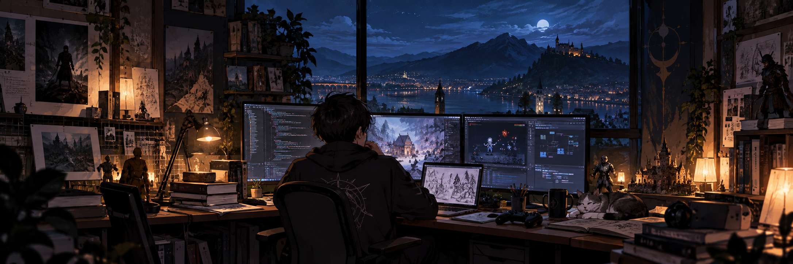

<h1 align="center">
  Phaethon
</h1>

<h3 align="center">Software · Intelligence · Worlds</h3>

I build software, explore artificial intelligence, and make games.

My work tends to sit somewhere between engineering and creative development:
systems that solve practical problems, tools that make complex workflows simpler,
and interactive worlds built around an idea rather than a template.

I care about understanding how things work beneath the surface — from APIs,
databases, and distributed systems to rendering pipelines, game mechanics,
AI workflows, and the small details that make an experience feel deliberate.

---

## What I'm Building

### Artificial Intelligence

  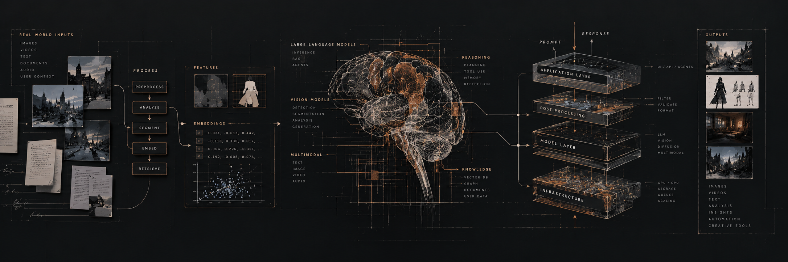

I work with AI as a building material rather than a feature to bolt onto an
application.

I've worked on systems involving:

- Generative image and video workflows
- AI-assisted content generation
- Image analysis and computer vision
- Segmentation and image manipulation
- AI-assisted creative tools
- Retrieval, context processing, and document understanding

Some of this work involves connecting models to real products rather than
building isolated demonstrations — dealing with storage, APIs, queues,
authentication, multi-tenancy, model constraints, and everything surrounding
the model itself.

### Software

  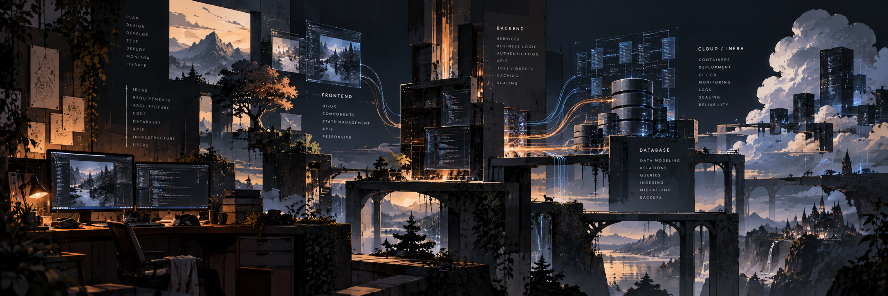

My primary background is in full-stack engineering and distributed services.

I focus on building reliable, well-structured foundations:

- High-throughput REST APIs and asynchronous backend workflows
- Data modeling across relational and document stores (PostgreSQL, MongoDB) with Redis caching
- Responsive web applications and cross-platform mobile clients (React, Next.js, Flutter)
- Production deployments with Docker, task queues, and cloud infrastructure (AWS)
- Multi-tenant SaaS architectures, authentication systems, and third-party integrations

I care about clean abstractions, predictable state, and building systems that remain maintainable long after launch.

I prefer systems that are understandable before they are clever.

---

## Games

  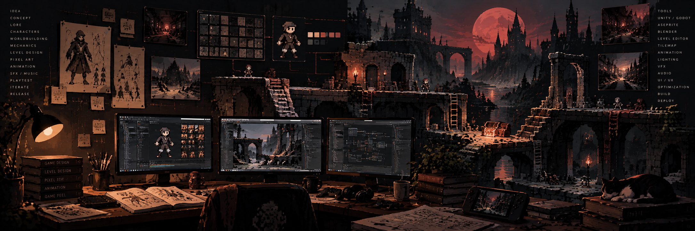

Games are where my engineering background meets the part of development that
doesn't fit neatly into an API or database schema.

I am interested in:

- Game systems
- Narrative design
- Worldbuilding
- Game mechanics
- Level design
- Environmental storytelling
- Pixel art
- 3D art and Blender
- Experimental interaction

I'm particularly interested in small games with a strong identity — games
that can communicate an idea through mechanics, atmosphere, and player
interaction rather than relying entirely on exposition.

---

## Repositories & Work

My open-source work, architectural experiments, and interactive prototypes are hosted across my public repositories here on GitHub.

All public repositories are open and available to explore, inspect, and review. Feedback, discussions, and code reviews are always welcome.

---

## Toolkit & Ecosystem

  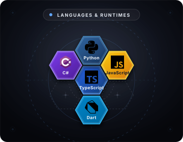
  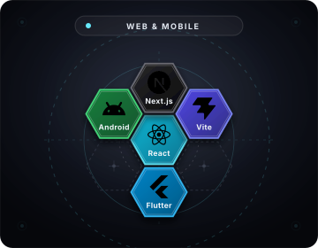

  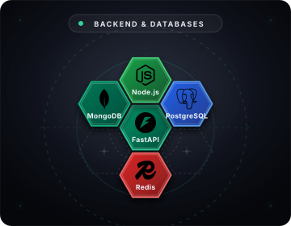
  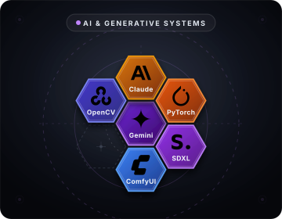

  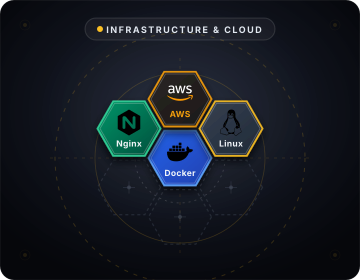
  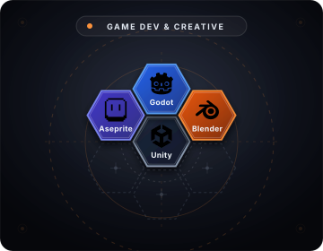

  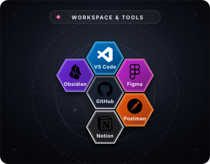

---

## Connect

If you'd like to collaborate, discuss architecture, or exchange ideas around software, games, and AI:

- **Email**: [phaethon.dev@gmail.com](mailto:phaethon.dev@gmail.com)

 

  <em>Ad astra memoria</em>

